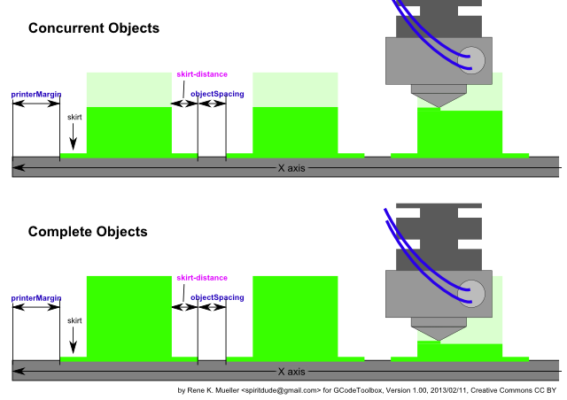

<h1>GCodeToolbox<h1>

<b>Version: 0.010 (ALPHA)</b>

GCodeToolbox (<tt>gctoolbox</tt>) is a command-line perl-script to manipulate .gcode files (for 3D printers & RepRaps) as created by slicers (like Slic3r or Skeinforge) from .stl files. 

The main aim of this package is to be able to 
<ol>
<li>create various pieces (.gcode) with different settings (infill, infill-methods, extrude temperature etc) and 
<li><b>then</b> concatenate (cat) them for <b>one print</b> (yet untested), see for <a href="tests/array/">ABS & PLA Plate examples</a>.
</ol>

<h2>History</h2>
<ul>
<li> 2013/02/12: 0.010: rudimentary sequence 'concurrent' implemented (each slice per object) and default behaviour, --sequence=complete old behaviour
<li> 2013/02/11: 0.009: headX/Y/Z introduced, extruderDiameter abandoned 
<li> 2013/02/11: 0.008: printerExtruderDiameter input, affects objectSpacing & slicer.skirt-distance (slic3r)
<li> 2013/02/10: 0.007: conf and fileList support
<li> 2013/02/09: 0.006: fanSpeed and temperature arguments possible, override gcode, proper filtering of object settings
<li> 2013/02/09: 0.005: proper header and trailer if objects are concated
<li> 2013/02/09: 0.004: proper movement at wrapping at concatenating (inserting G1 moves)
<li> 2013/02/09: 0.003: optional left-to-right to right-to-left swinging
<li> 2013/02/09: 0.002: passing slicer arguments via --slicer.[key]=[value]
<li> 2013/02/08: 0.001: start coding, first version, info and concat works
</ul>

<h2>Installation</h2>
<pre>
% make install
</pre>

which copies the <tt>gctoolbox</tt> to /usr/local/bin/ - that's all.

<h2>Usage</h2>
<pre>
GCodeToolbox 0.009: gctoolbox [switches] [cmd] [file1]..[fileN]

        info [file1]...    provide info on .gcode files
        slice [file1]...   slice .stl files to .gcode
        cat [file1]...     concat multiple .gcode files to stdout

        -h or --help       this help
        -v or --verbose=v  increase verbosity
        --slicer=cmd       define slicer (default: slic3r)
        --slicer.[arg]=x   define slicer arguments passed on slicer (e.g. --slicer.skirts=0)
        --printer=file     reference printer profile
        --printerX=x       define build width (default: 200) [mm]
        --printerY=y       define build depth (default: 200) [mm]
        --printerZ=z       define build height (default: 200) [mm]
        --printerMargin=m  define margin to perimeter of platform (default: 3) [mm]
        --printerHeadX=x   define head width (default: 16) [mm]
        --printerHeadY=y   define head depth (default: 16) [mm]
        --printerHeadZ=z   define head height (default: 50) [mm]
        --cols=c           define columns when concat(enating) (default none, auto-overflow) [mm]
        --objectSpacing=x  define distance between items when concat (default: 3) [mm]
        --fanSpeed=s       define fan-speed (s=0-255) (default none, defined in gcode)
        --temperature=t    define extruder temperature (default none, defined in gcode)
        --conf=file        configuration file, all command-line arguments (without '--'), one per line
        --fileList=file    file with list of files (one file per line)
</pre>

<h2>Examples</h2>

<h3>Information of GCode</h3>

<pre>
% gctoolbox info cube10mm.gcode
</pre>

prints out some information about the actual gcode

<h3>Slicing STL to GCode</h3>

<pre>
% gctoolbox slice cube10mm.stl
% gctoolbox --slicer=slic3r --slicer.skirt_distance=2 slice cube10mm.stl
</pre>
creates cube10mm.gcode, default slicer is Slic3r, and arguments for the slicer can be given by --slicer.[arg]=[value].
<pre>
% gctoolbox --slicer=skeinforge slice cube10mm.stl
</pre>
use another slicer backend, it has to create .gcode

<h3>Concatenate</h3>

Concatenating (short 'cat', like the UNIX command 'cat') is the main feature of GCodeToolbox.

<pre>
% gctoolbox cat cube10mm.gcode inchAxis.gcode > mixed.gcode
</pre>
concatenate several gcode files into one gcode.

You can also define a multiplication:

<pre>
% gctoolbox cat 10x cube10mm.gcode 3x inchAxis.gcode > mixed2.gcode
</pre>
which concatenates 10 times cube10mm's and 3 times inchAxis's.

By default pieces are arranged left-to-right and when it overflows they are a placed further on the platform, but you can force wrapping:
<pre>
% gctoolbox --cols=5 cat 25x cube10mm.gcode > 25cubes5x5.gcode
</pre>

which is ideal when a grid of test objects with different settings are made (e.g. per row one temperature, per column certain settings like infill density).

<pre>
% gctoolbox --fileList=myfiles.list cat > mixed3.gcode
</pre>

whereas <b>myfiles.list</b> is
<pre>
# my objects
cube10mm.gcode
cube10mm.gcode
inchAxis.gcode
inchAxis.gcode
steps5mm.gcode
steps5mm.gcode
</pre>

<h3>Printer Definition</h3>

You can define a profile of your printer (default X=200, Y=200, Z=200 and margin=3), with e.g. "myprinter.conf":
<pre>
# MyPrinter (all measurements in mm)
X = 150
Y = 180
Z = 120
margin = 3              
headX = 20     # -- important to set to avoid collision when objects are concat(enat)ed
headY = 25     #    dito
headZ = 50     # -- important, defines maxZ of an object to be printed in "complete object"-sequence (default)
</pre>
   
defines the build-volume, margin of the built-platform toward the pieces, all variables of .conf file are also available via command-line --printer[key]=[value] as well ([key] starts with uppercase letter), for example:

<pre>
% gctoolbox --printer=myprinter.conf cat 10x cube10mm.gcode > 10cubes.gcode
% gctoolbox --printerX=200 --printerY=180 --printerMargin=5 --printerHeadX=20 --printerHeadY=25 --objectSpacing=5 3x cube10mm.gcode > 3cubes.gcode
</pre>

<h3>Sequences</h3>

There are two modes available (via --sequence=s) when con<b>cat</b>enating:
<ul>
<li><b>concurrent</b> (default): a layer of all objects are printed together; hardware settings like temperature cannot be changed (would slow down printing immensely).
<li><b>complete</b>: each object is printed complete before moving the next object, it allows to print objects with different temperatures (e.g. profiling printing material like PLA or ABS) like
these <a href="tests/array/">test plates (ABS & PLA)</a>, yet 
</ul>

Since version 0.010 --sequence=concurrent is default, and --sequence=complete is available optionally (prior 0.010 --sequence=complete was default).

<h3>Collision Awareness</h3>

When using --sequence=complete the objects are printed individually complete first, which poses some danger that the extruder nozzle crashes into existing already printed items:

<tt>gctoolbox</tt> prints out a warning if these conditions are not met, and increases objectSpacing so there is no collision; important is to set the headX & headY properly.
By default headY = headX unless you define headY explicit as well. headZ defines the maxium objectZ to printed in this manner.

<h3>Tests</h3>

<pre>
% make tests
</pre>

and it will do some tests in tests/ and tests/array/; best explore the files.

<h3>Visualization</h3>

Best visit http://www.buildlog.net/gview/ and simply drag&drop your .gcode file to the browser-window, and it will preview the gcode.

That's all for now,

Rene K. Mueller 
initial 2013/02/08, update 2013/02/09
