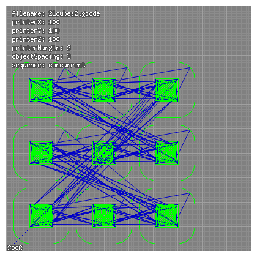
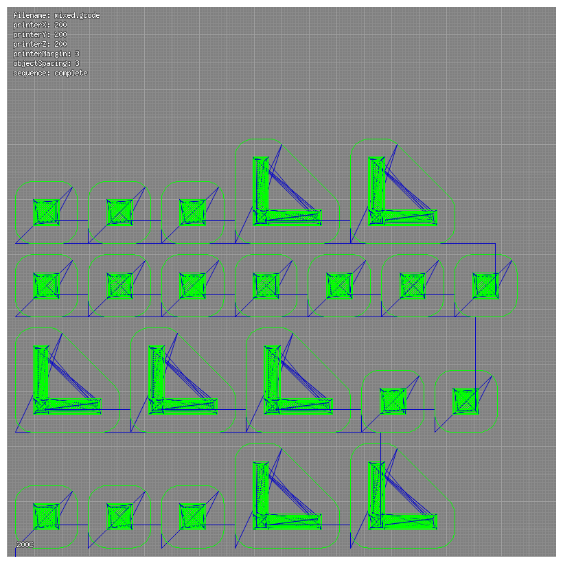
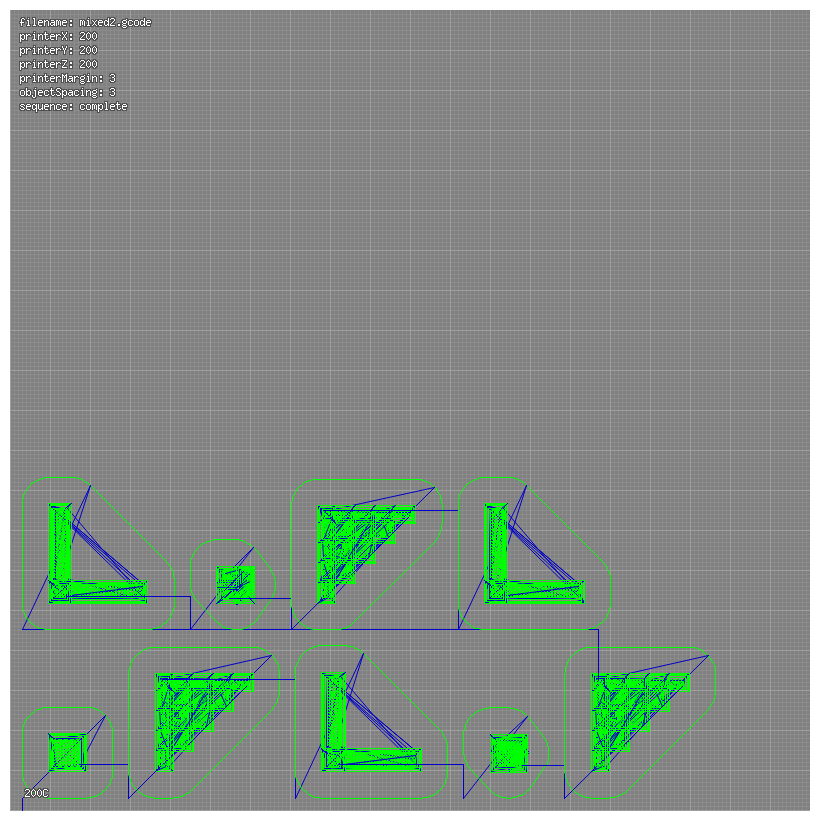

A few tests, e.g. 
<ul>
<li>21cubes.gcode and 21cubes2.gcode (with smaller platform to test insufficient space)
<li>9cubes3x3.gcode with wrapping (--cols=3)
<li>mixed.gcode mixed items
<li>mixed2.gcode reading objects from file list (file01.list)
<li>etc.
</ul>

