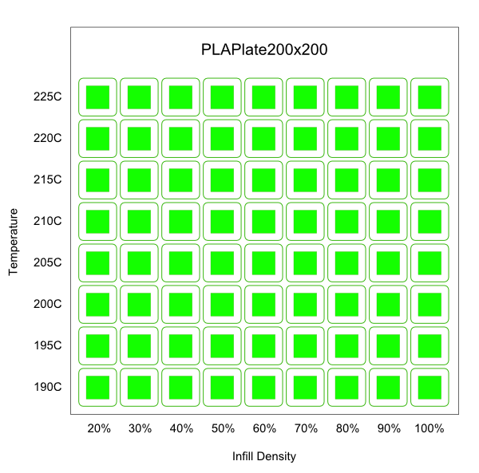

Creates an ABS & PLA test plate (200x200) of cubes with various infills and extrusion temperatures in <b>one print</b>.

Once you ran <tt>make</tt> you get:
<ul>
<li>ABSPlate200x200.gcode: one row per temperature (225-250C @5C steps) and per column (1-8) infill 30%-100%
<li>PLAPlate200x200.gcode: one row per temperature (190-225C @5C steps) and per column (1-8) infill 30%-100%
</ul>

It enables you to profile your filament very precisely with <b>one print</b> only.

<h3>References</h3>
<ul>
<li><a href="http://reprap.org/wiki/ABS">ABS</a>
<li><a href="http://reprap.org/wiki/PLA">PLA</a>
</ul>
